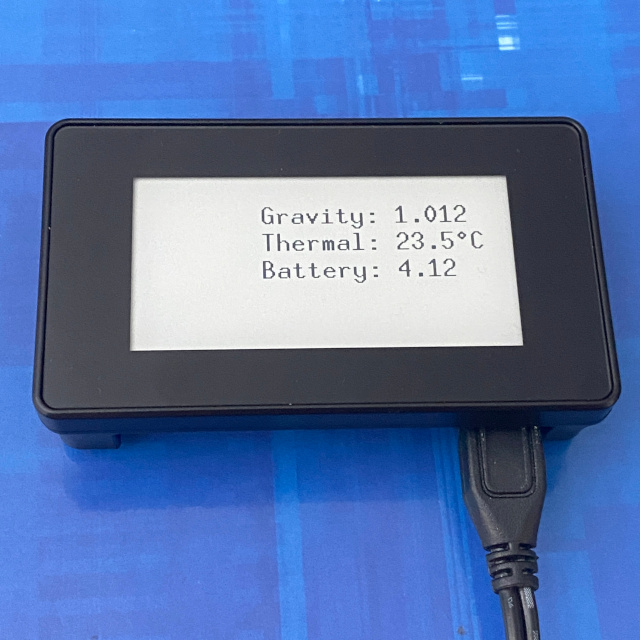
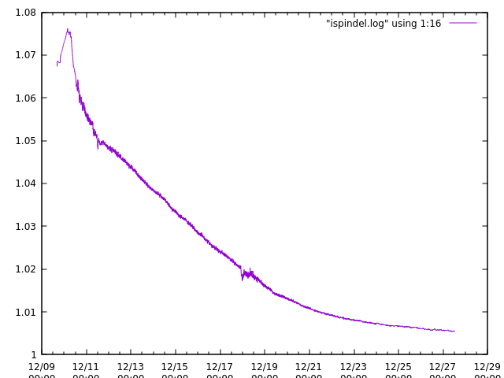

# iSpindel HTTP Receiver
## What is an iSpindel?
An iSpindel is an IoT hydrometer used in brewing. It floats inside the fermentation vessel, reporting the gravity density of the solution to the outside world, using the angle upon which it leans at to determine the amount of sugar remaining in the solution. The more sugars remaining, the shallower the angle. Pure water should be 25 degrees, which equates to 1.000 specific gravity.

The data reports are sent periodically (usually 15 mins), between deep-sleeps on the ESP32 to conserve battery. It uses a HTTP POST method to send JSON-formatted data over a temporary wireless connection. It is therefore important that there is a service listening 24/7 to receive these reports.

## Introduction
This project aims to be the server for an iSpindel in two-ways:
- A dedicated server for recording / display for iSpindel logs & statistics
- An access point which the iSpindel / fermenter can be in close proximity to

With the optional access point use-case, there are numerous benefits:
- Connection is more reliable as it could be physically closer to the vessel
- Saves power with the iSpindel battery if closer
- Take the network to the fermenter, rather than the fermenter to the network
- Can run in an air-gapped environment (e.g shed, basement, attic)
- Could be physically located above the fermenter, as liquid is not a good conductor of 2.4GHz wireless
- Live results can be viewed locally (e.g. ePaper / eInk or via a monitor)

Features of the script itself:
- Logs iSpindel JSON results to a file called ispindel.log
- Can be run under systemd upon start
- Display uses a minimal bitmap font that moves around the eInk screen
- Display is cleared on controlled shutdown

## Usage ##
To run manually:
```
cd ispindel-http-server.py
python3 ispindel-http-server.py
```

Logs are present in the local directory. A systemd startup script has been supplied, so logs may appear under root(/).

## Hardware Used
- iSpindel 
- Raspberry Pi Zero W
- (Optional) Waveshare 2.13" Touch e-Paper Hat V2 (250x122)



## Packages Required
### Access Point
Install hostapd, dnsmasq (for DHCP server) and GNU screen for a persistent shell:
```
$ sudo apt-get install hostapd dnsmasq screen
```

### Waveshare e-Paper

Ensure key Python helpers / libs are available:
```
$ sudo apt-get install git python3-pip python3-pil python3-numpy
```

These Python packages should already be active on the Raspberry Pi, but if not:
```
$ sudo pip3 install RPi.GPIO spidev
```

### A Copy Of This Repo
Also don't forget to drop this repo onto your Raspberry Pi if you are building this as an access point. The following steps will take the device off the network! If you don't, you may need to use a USB stick to move the files over.

## Access Point Setup

:warning: **WARNING**: By using this configuration, network access will be lost unless the access point is fully functional. Ensure there's an alternative approach to resolve issues (i.e. keyboard & monitor to the Raspberry Pi).

Enable the SSH server, so that it's possible to log in:

```
$ sudo raspi-config
    3. Interface Options 
        I2 SSH (Enable)
```

Install hostapd, dnsmasq (for DHCP server) and screen for a persistent shell:
```
$ sudo apt-get install hostapd dnsmasq screen
```

Disable power-saving on wifi when acting as an access point:
```
$ sudo echo "wireless-power off" > /etc/network/interfaces.d/wireless-pm-off
```

Set up the networking for the Raspberry Pi (static ip of 192.168.0.1):
```
$ sudo vi /etc/network/interfaces.d/ispindel
allow-hotplug wlan0
iface wlan0 inet static
    address 192.168.0.1
    netmask 255.255.255.0
    network 192.168.0.0
```

Stop the DHCP client daemon from interfering with our AP, but allowing it to
work with other interfaces (e.g. eth0, wlan1):
```
$ sudo echo "denyinterfaces wlan0" >> /etc/dhcpcd.conf
```

Set up dnsmasq to act as a lightweight DHCP server on wlan0 / 192.168.0.0:
```
$ sudo vi /etc/dnsmasq.d/ispindel
interface=wlan0
dhcp-range=192.168.0.2,192.168.0.254,255.255.255.0,12h
```

Set up the HostAP to do the authentication of wifi clients:
```
$ sudo vi /etc/hostapd/hostapd.conf
interface=wlan0
ssid=ispindel
hw_mode=g
channel=1
wpa=2
wpa_pairwise=TKIP
rns_pairwise=CCMP
wpa_key_mgmt=WPA-PSK
wpa_passphrase=passwordgoeshere
```

HostAP is not enabled to work on boot - enable it:
```
$ sudo systemctl unmask hostapd
$ sudo systemctl enable hostapd
```

A reboot is probably the best option to see if everything is working:
```
$ sudo reboot
```

Otherwise, restart everything piece-by-piece:
```
$ sudo systemctl restart dhcpcd
$ sudo systemctl restart networking
$ sudo systemctl restart dnsmasq
$ sudo systemctl start hostapd
```

If all is fine, it may be worth decommissioning the following services:
- dhcpcd
- wpa_supplicant

## Waveshare ePaper Preparation

Enable SPI:
```
$ sudo raspi-config
    3. Interface Options
        I4 SPI (Enable)
```

## iSpindel HTTP Server start
The iSpindel server could be run inside GNU screen now:
```
$ screen
<-- Now inside screen shell -->
$ python3 ispindel-http-server.py
```

See the extras folder for a systemd startup script, but please remember to customise to whereever you decide to install the script.

## Appendix A: Basic Plotting
A GNU Plot example for basic charting is available under extras directory. 
To use:
```gnuplot -p ispindel.gnuplot```
Example output:



## Appendix B: iSpindel calibration

First, ensure your iSpindel is calibrated to 25 degrees in water. 

When done, ensure you have a hydrometer (not a refractometer!) and a notebook to take readings over the next days / weeks.

Then put together a basic recipe for a calibration sugar wash:

**Ingredients for a 1.090SG / 21.57 Brix / 12.14% ABV wash**
- 705.39g caster sugar (finer, so dilutes faster)
- Water, topped up to make 3L
- Yeast nutrient
- Any fast yeast: 
  - Killer yeast such as EC1118 (cheap, flexible, aggressive, good restarter)
  - Kveik yeast (needs heat, but will ferment out in days)
  - Turbo yeasts (high alcohol potential)

If this goes too slow, see the [Birdwatchers Sugar Wash](https://birdwatchers.info/instructions/) for a highly calibrated fermentable solution. Most yeasts come with additives / nutrients to aid the yeast with initial growth anyway.
